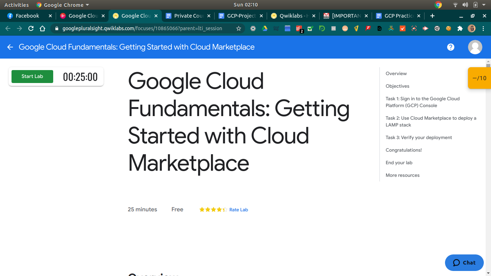

# Google Africa Developer Scholarship Phase II
## Google Cloud Practice Project
### Description

During Learning Phase 2 participants in the Cloud track of the GADS 2020 program shall be encouraged to explore the possibilities and opportunities to work with the gcloud SDK more in detail.

Due to limitations in regards to accessing free Google Cloud Platform (GCP), the Google Cloud challenge is based on the available hands-on labs on Qwiklabs provided by Pluralsight. Learners in the Cloud track have free access to a selection of fundamental labs on GCP.

# The Challenges
## Associate Cloud Engineer: Learning Phase 1 Main Track Channel (2020)

### Course: Google Cloud Platform Fundamentals - Core Infrastructure
#### GCP Fundamentals: Getting Started with Cloud Marketplace 

#### GCP Fundamentals: Getting Started with Compute Engine 

#### GCP Fundamentals: Getting Started with Cloud Storage and Cloud SQL 

#### GCP Fundamentals: Getting Started with Kubernetes Engine 

#### GCP Fundamentals: Getting Started with App Engine 

#### GCP Fundamentals: Getting Started with Deployment Manager and Stackdriver 

#### GCP Fundamentals: Getting Started with BigQuery 

## (To be Continued)

# Course: Essential Google Cloud Infrastructure: Foundation

## Console and Cloud Shell 